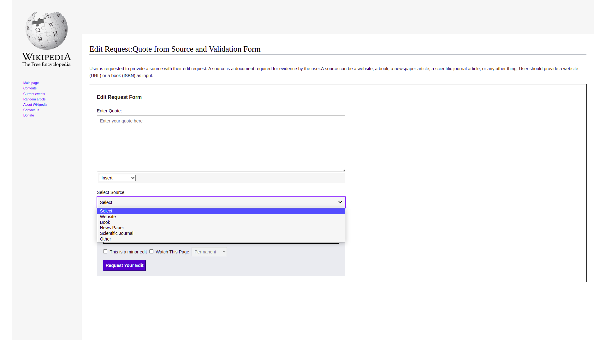
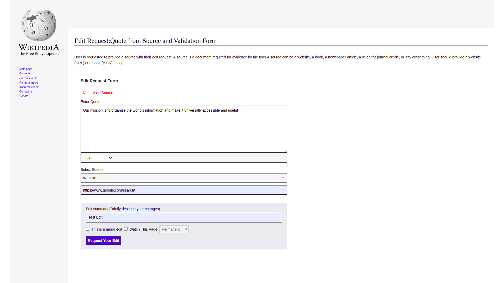
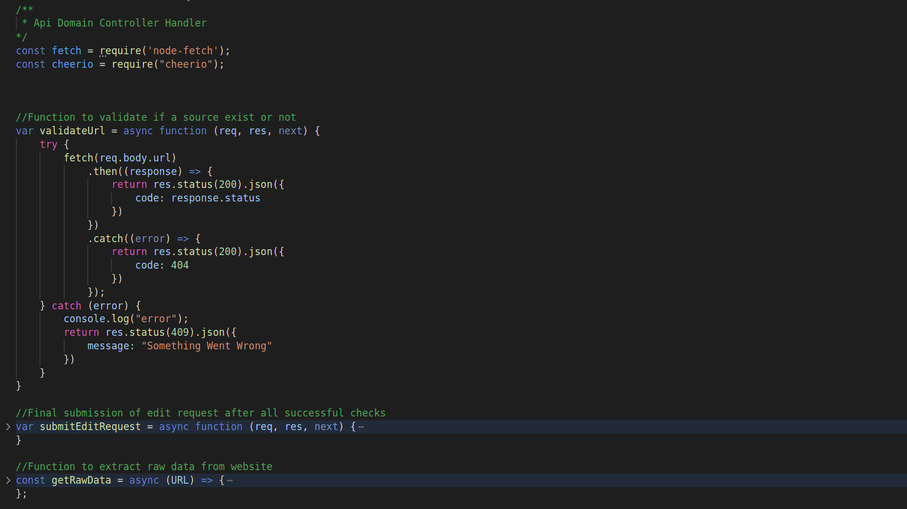
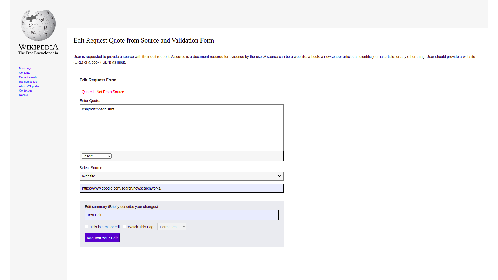
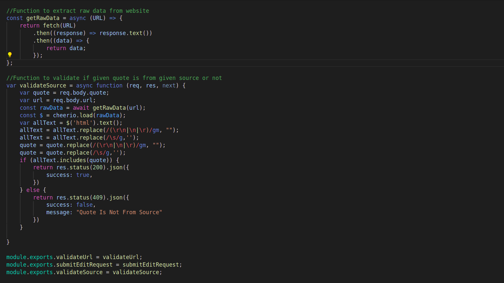
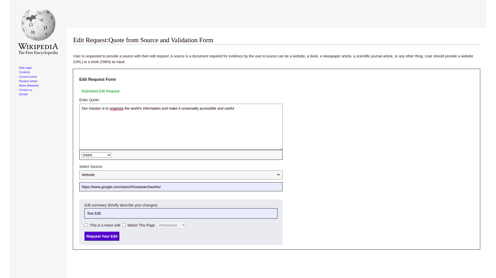

## How To Use

# Entering A Quote

First you need you go to my microtask at [https://abhigya-pandey-editrequest.herokuapp.com/](https://abhigya-pandey-editrequest.herokuapp.com/).
Then you will see a webpage something like this

Now you enter a quote from a valid source to complete your edit request.
If you enter a null string or same charatcher repeated in complete string, you will recive an error saying "Not a Valid Quote" on submiting the form.

 

 

Function to validate Quote is as follows in [./public/js/app/index.js](./public/js/app/index.js) file.

# Selecting A Source

Once you enter a valid Quote you will be asked to select a source type from which your quote belongs.
Then some input fields will appear according to your selected source type. You need to provide link to your source which is mandetory.

If your provided link does not exist or is broken then you will recive an error message saying "Not a Valid Source" on submiting the form.

The api call which validates the url of a source is written in [./public/js/app/index.js](./public/js/app/index.js) and [./api/resources/domain/domain.controller.js](./api/resources/domain/domain.controller.js).

 

# Validating The Quote

Once you enter a valid Quote and Source your quote will be checked from source if quote belongs to that particular source or not.
If your provided quote that does not exist on the given source then you will recive an error message saying "Quote Is Not From Source" on submiting the form.

The api call which validates the url of a source is written in [./public/js/app/index.js](./public/js/app/index.js) and [./api/resources/domain/domain.controller.js](./api/resources/domain/domain.controller.js) and validation is done using cheerio web scrapper.

 

Finally if all the validations are passed your edit request is submitted successfully.

